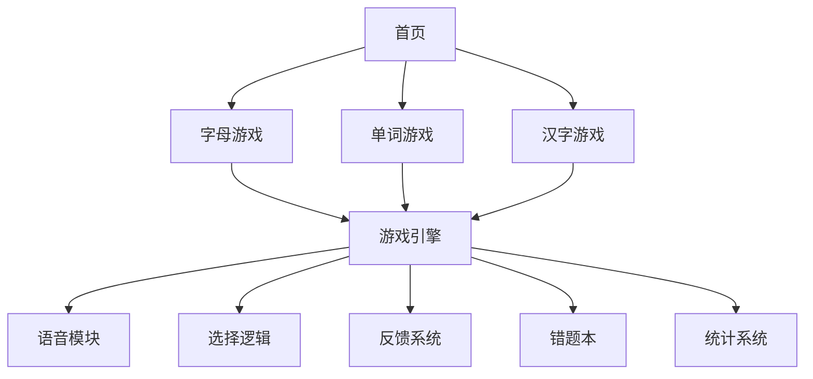

## 产品概述

为5岁儿童创建综合学习游戏平台，包含字母、单词、汉字三类学习游戏，统一采用图片选择+语音发音的交互模式。

## 核心功能

1. **首页入口**：展示3个游戏卡片入口，每个卡片包含图标、标题、简介
2. **26个字母游戏**：

- **显示字母大小写**：主卡片显示大写和小写字母（A a）
- **发音**：点击朗读字母名称
- **选择练习**：从4个包含该字母的单词中选择（字母高亮显示）
- **学习目标**：通过寻找单词中的字母，逐步认识字母

3. **英语单词游戏**：复用现有word_game_v3.html的完整功能
4. **汉字游戏**：学习基础汉字（基于《四五快读》第一册，共50个汉字）
5. **汉字游戏Plus**：句子跟读模式

- **短句练习**：使用已学汉字组成短句（10-15字）
- **跟读功能**：点击播放整句朗读
- **手动翻页**：家长领读，手动切换下一句
- **句子来源**：基于《四五快读》第一册课文

6. **统一交互模式**：四选一、语音朗读、星星动画、错题本、统计数据

## 用户偏好

- 适合5岁儿童的界面设计
- 鼓励式学习（星星动画、语音鼓励）
- 错题自动复习机制
- **图片资源支持高清图片，可自定义配置**

## 技术栈选择

- **前端架构**：单页应用（SPA），纯HTML文件
- **语音合成**：Web Speech API（浏览器原生）
- **数据存储**：localStorage（本地持久化）
- **图片资源**：
- **默认图片**：使用Unsplash API获取高清图片（免费、可商用）
- **备选方案**：emoji作为轻量级备选
- **自定义上传**：支持用户上传本地图片（File API + Base64）
- **图片存储**：localStorage存储Base64编码（单文件架构）
- **样式框架**：内联CSS + 响应式设计

## 图片配置系统（新增）

### 默认图片来源

使用 **Unsplash Source API**（无需API Key，免费可用）：

```javascript
// 图片URL格式
const imageUrl = `https://source.unsplash.com/featured/?${keyword}`;

// 示例
const appleImage = "https://source.unsplash.com/featured/?apple,fruit";
const dogImage = "https://source.unsplash.com/featured/?dog,animal,cute";
```

**优势**：

- ✅ 完全免费，无需注册
- ✅ 高清图片（自动适配尺寸）
- ✅ 可商用（Unsplash License）
- ✅ 自动搜索相关图片
- ✅ 支持关键词组合搜索

### 字母游戏图片映射（26个字母）- 更新版

**游戏玩法调整**：

- **主卡片显示**：字母的大写和小写（A a）
- **选择项**：包含该字母的单词图片（字母高亮显示）
- **目标**：通过寻找单词中的字母，逐步认识字母

```javascript
const alphabetImages = {
  "A": {
    keyword: "apple,fruit",
    word: "Apple",
    chinese: "苹果",
    image: "https://source.unsplash.com/featured/?apple,fruit",
    emoji: "🍎",
    // 选择项示例：包含字母A的单词
    choices: ["Apple", "Ant", "Airplane", "Arrow"]
  },
  "B": {
    keyword: "bee,insect",
    word: "Bee",
    chinese: "蜜蜂",
    image: "https://source.unsplash.com/featured/?bee,insect",
    emoji: "🐝",
    choices: ["Bee", "Ball", "Book", "Bird"]
  },
  // ... A-Z共26个
};
```

**字母高亮显示逻辑**：

```javascript
// 在单词中高亮显示目标字母
function highlightLetter(word, letter) {
  return word.split('').map(char => {
    if (char.toLowerCase() === letter.toLowerCase()) {
      return `<span class="highlight-letter">${char}</span>`;
    }
    return char;
  }).join('');
}

// 示例效果
// Apple -> <span class="highlight-letter">A</span>pple
// B<span class="highlight-letter">e</span><span class="highlight-letter">e</span>
```

**选择卡片设计**：

```html
<!-- 选择卡片显示包含字母的单词 -->
<div class="choice-card">
  
  <div class="word">
    <!-- 字母A高亮显示 -->
    <span class="highlight">A</span>pple
  </div>
</div>
```

**CSS高亮样式**：

```css
.highlight-letter {
  color: #ff4757;
  font-weight: bold;
  font-size: 1.3em;
  text-shadow: 0 0 8px rgba(255, 71, 87, 0.5);
}
```

### 单词游戏图片映射（扩展现有数据）

将现有emoji替换为高清图片：

```javascript
const wordImages = {
  "Dog": {
    emoji: "🐕",  // 保留emoji作为备选
    image: "https://source.unsplash.com/featured/?dog,cute",
    chinese: "狗"
  },
  "Apple": {
    emoji: "🍎",
    image: "https://source.unsplash.com/featured/?apple,fruit",
    chinese: "苹果"
  },
  // ... 其他单词
};
```

### 汉字游戏图片映射（示例）

```javascript
const chineseImages = {
  "人": {
    pinyin: "rén",
    image: "https://source.unsplash.com/featured/?person,people",
    emoji: "👤"
  },
  "大": {
    pinyin: "dà",
    image: "https://source.unsplash.com/featured/?big,large",
    emoji: "📏"
  },
  "水": {
    pinyin: "shuǐ",
    image: "https://source.unsplash.com/featured/?water,blue",
    emoji: "💧"
  },
  // ... 其他汉字
};
```

### 自定义图片上传功能

**实现方案**：

```javascript
class ImageConfigManager {
  constructor(gameType) {
    this.gameType = gameType;
    this.storageKey = `${gameType}_image_config`;
  }

  // 上传图片并保存为Base64
  async uploadImage(word, file) {
    return new Promise((resolve, reject) => {
      const reader = new FileReader();
      reader.onload = (e) => {
        const base64 = e.target.result;
        this.saveImageConfig(word, base64);
        resolve(base64);
      };
      reader.onerror = reject;
      reader.readAsDataURL(file);
    });
  }

  // 保存图片配置
  saveImageConfig(word, imageData) {
    const config = this.loadImageConfig();
    config[word] = imageData;
    localStorage.setItem(this.storageKey, JSON.stringify(config));
  }

  // 加载图片配置
  loadImageConfig() {
    const config = localStorage.getItem(this.storageKey);
    return config ? JSON.parse(config) : {};
  }

  // 获取图片（优先自定义，其次默认）
  getImage(word) {
    const customConfig = this.loadImageConfig();
    if (customConfig[word]) {
      return customConfig[word]; // 用户自定义图片
    }
    return this.getDefaultImage(word); // 默认图片
  }

  // 恢复默认图片
  resetImage(word) {
    const config = this.loadImageConfig();
    delete config[word];
    localStorage.setItem(this.storageKey, JSON.stringify(config));
  }
}
```

### 图片配置UI界面

**配置面板设计**：

```html
<div class="image-config-panel">
  <h3>图片配置</h3>
  <div class="config-list">
    <!-- 每个单词的配置项 -->
    <div class="config-item">
      <div class="preview">
        
        <span class="word">Apple</span>
      </div>
      <div class="actions">
        <input type="file" accept="image/*" />
        <button class="upload-btn">上传图片</button>
        <button class="reset-btn">恢复默认</button>
      </div>
    </div>
    <!-- 更多配置项... -->
  </div>
</div>
```

**交互流程**：

1. 用户点击"配置图片"按钮
2. 展开配置面板，显示所有单词
3. 每个单词显示当前图片预览
4. 点击"上传图片"选择本地文件
5. 图片自动裁剪、压缩、转为Base64
6. 保存到localStorage
7. 游戏中自动使用新图片

### 图片优化处理

**自动裁剪和压缩**：

```javascript
// 图片压缩和裁剪（避免localStorage超出限制）
function compressImage(file, maxWidth = 400, maxHeight = 400) {
  return new Promise((resolve) => {
    const canvas = document.createElement('canvas');
    const ctx = canvas.getContext('2d');
    const img = new Image();
    
    img.onload = () => {
      // 计算缩放比例
      const ratio = Math.min(maxWidth / img.width, maxHeight / img.height);
      canvas.width = img.width * ratio;
      canvas.height = img.height * ratio;
      
      // 绘制图片
      ctx.drawImage(img, 0, 0, canvas.width, canvas.height);
      
      // 转为Base64（JPEG格式，质量0.8）
      const base64 = canvas.toDataURL('image/jpeg', 0.8);
      resolve(base64);
    };
    
    img.src = URL.createObjectURL(file);
  });
}
```

## 实现方案

### 架构设计

采用模块化单文件架构，通过状态管理切换不同游戏模块：



### 数据结构设计

**字母游戏数据**（字母识别模式）：

```javascript
{
  "A": {
    uppercase: "A",
    lowercase: "a",
    image: "https://source.unsplash.com/featured/?apple,fruit",
    emoji: "🍎",
    word: "Apple",
    chinese: "苹果",
    // 4个包含字母A的单词选项
    choices: ["Apple", "Ant", "Airplane", "Arrow"]
  },
  "B": {
    uppercase: "B",
    lowercase: "b",
    image: "https://source.unsplash.com/featured/?bee,insect",
    emoji: "🐝",
    word: "Bee",
    chinese: "蜜蜂",
    choices: ["Bee", "Ball", "Book", "Bird"]
  },
  "C": {
    uppercase: "C",
    lowercase: "c",
    image: "https://source.unsplash.com/featured/?cat,cute",
    emoji: "🐱",
    word: "Cat",
    chinese: "猫",
    choices: ["Cat", "Car", "Cake", "Cup"]
  },
  // ... A-Z共26个
}
```

**完整字母关键词和选项映射表**：

| 字母 | 主单词 | 中文 | 选择项（包含该字母） |
| --- | --- | --- | --- |
| A | Apple | 苹果 | Apple, Ant, Airplane, Arrow |
| B | Bee | 蜜蜂 | Bee, Ball, Book, Bird |
| C | Cat | 猫 | Cat, Car, Cake, Cup |
| D | Dog | 狗 | Dog, Duck, Door, Desk |
| E | Elephant | 大象 | Elephant, Egg, Eye, Ear |
| F | Fish | 鱼 | Fish, Flower, Fox, Flag |
| G | Goat | 山羊 | Goat, Giraffe, Girl, Gate |
| H | Horse | 马 | Horse, House, Hand, Hat |
| I | Ice Cream | 冰淇淋 | Ice Cream, Igloo, Insect, Island |
| J | Jellyfish | 水母 | Jellyfish, Juice, Jump, Jet |
| K | Kangaroo | 袋鼠 | Kangaroo, King, Key, Kite |
| L | Lion | 狮子 | Lion, Lamp, Leaf, Leg |
| M | Mouse | 老鼠 | Mouse, Moon, Milk, Monkey |
| N | Nest | 鸟巢 | Nest, Nose, Nut, Net |
| O | Orange | 橙子 | Orange, Owl, Ocean, Onion |
| P | Pig | 猪 | Pig, Pen, Pan, Pear |
| Q | Queen | 女王 | Queen, Quilt, Question, Quiet |
| R | Rabbit | 兔子 | Rabbit, Rain, Rose, Ring |
| S | Sun | 太阳 | Sun, Star, Snake, Ship |
| T | Tiger | 老虎 | Tiger, Tree, Toy, Train |
| U | Umbrella | 雨伞 | Umbrella, Up, Uncle, Under |
| V | Violin | 小提琴 | Violin, Van, Vase, Vest |
| W | Whale | 鲸鱼 | Whale, Water, Window, Wing |
| X | Xylophone | 木琴 | Xylophone, X-ray, Box, Fox |
| Y | Yacht | 游艇 | Yacht, Yellow, Yes, You |
| Z | Zebra | 斑马 | Zebra, Zoo, Zip, Zero |


**完整字母图片关键词映射表**：

| 字母 | 关键词 | 单词 | 中文 |
| --- | --- | --- | --- |
| A | apple,fruit | Apple | 苹果 |
| B | bee,insect | Bee | 蜜蜂 |
| C | cat,cute | Cat | 猫 |
| D | dog,puppy | Dog | 狗 |
| E | elephant,animal | Elephant | 大象 |
| F | fish,sea | Fish | 鱼 |
| G | goat,animal | Goat | 山羊 |
| H | horse,animal | Horse | 马 |
| I | icecream,food | Ice Cream | 冰淇淋 |
| J | jellyfish,sea | Jellyfish | 水母 |
| K | kangaroo,animal | Kangaroo | 袋鼠 |
| L | lion,animal | Lion | 狮子 |
| M | mouse,animal | Mouse | 老鼠 |
| N | nest,bird | Nest | 鸟巢 |
| O | orange,fruit | Orange | 橙子 |
| P | pig,animal | Pig | 猪 |
| Q | queen,person | Queen | 女王 |
| R | rabbit,animal | Rabbit | 兔子 |
| S | sun,sky | Sun | 太阳 |
| T | tiger,animal | Tiger | 老虎 |
| U | umbrella,rain | Umbrella | 雨伞 |
| V | violin,music | Violin | 小提琴 |
| W | whale,sea | Whale | 鲸鱼 |
| X | xylophone,music | Xylophone | 木琴 |
| Y | yacht,boat | Yacht | 游艇 |
| Z | zebra,animal | Zebra | 斑马 |


**汉字游戏数据**（基于《四五快读》第一册）：

**完整汉字列表（共50个汉字，分6课）**：

**第1课（16字）**：人、口、大、中、小、哭、笑、一、上、下、爸、妈、天、太、月、二

**第2课（8字）**：地、阳、亮、星、云、火、水、三

**第3课（8字）**：土、山、石、木、我、好、有、田

**第4课（8字）**：牛、羊、聪、耳、目、心、和、四

**第5课（8字）**：明、头、眉、鼻、手、花、树、五

**第6课（8字）**：草、叶、日、风、雨、的、孩、六

**数据结构示例**：

```javascript
{
  "人": {
    pinyin: "rén",
    image: "https://source.unsplash.com/featured/?person,people",
    emoji: "👤",
    lesson: 1
  },
  "大": {
    pinyin: "dà",
    image: "https://source.unsplash.com/featured/?big,large",
    emoji: "📏",
    lesson: 1
  },
  // ... 其他汉字
}
```

**教学特点**：

- 按课程分组，便于循序渐进学习
- 包含常用基础字（人、口、大、小等）
- 结合生活场景（爸、妈、天、地等）
- 数字穿插学习（一、二、三、四、五、六）

### 汉字游戏Plus：句子跟读模式（新增）

**功能定位**：

- 作为汉字游戏的扩展模式
- 适合家长带领孩子进行句子跟读练习
- 巩固已学汉字，培养语感

**句子数据设计**：

```javascript
const sentenceData = {
  lesson1: [
    {
      sentence: "我有好爸爸和好妈妈。",
      characters: ["我", "有", "好", "爸", "爸", "和", "好", "妈", "妈"],
      length: 10,
      translation: "I have a good dad and a good mom."
    },
    {
      sentence: "天上有太阳和月亮。",
      characters: ["天", "上", "有", "太", "阳", "和", "月", "亮"],
      length: 9,
      translation: "There are the sun and moon in the sky."
    },
    {
      sentence: "爸爸上山，妈妈下山。",
      characters: ["爸", "爸", "上", "山", "妈", "妈", "下", "山"],
      length: 8,
      translation: "Dad goes up the mountain, mom comes down."
    },
    {
      sentence: "大人哭，小人笑。",
      characters: ["大", "人", "哭", "小", "人", "笑"],
      length: 6,
      translation: "The adult cries, the child laughs."
    },
    {
      sentence: "天上有一个大太阳。",
      characters: ["天", "上", "有", "一", "个", "大", "太", "阳"],
      length: 8,
      translation: "There is a big sun in the sky."
    }
  ],
  lesson2: [
    {
      sentence: "天上有星星和月亮。",
      characters: ["天", "上", "有", "星", "星", "和", "月", "亮"],
      length: 8,
      translation: "There are stars and moon in the sky."
    },
    {
      sentence: "地上有水和火。",
      characters: ["地", "上", "有", "水", "和", "火"],
      length: 6,
      translation: "There is water and fire on the ground."
    },
    {
      sentence: "太阳出来了，天亮了。",
      characters: ["太", "阳", "出", "来", "了", "天", "亮", "了"],
      length: 8,
      translation: "The sun comes out, the sky is bright."
    },
    {
      sentence: "大火烧了三天。",
      characters: ["大", "火", "烧", "了", "三", "天"],
      length: 6,
      translation: "The big fire burned for three days."
    },
    {
      sentence: "水田里有小鱼。",
      characters: ["水", "田", "里", "有", "小", "鱼"],
      length: 6,
      translation: "There are small fish in the paddy field."
    }
  ],
  lesson3: [
    {
      sentence: "我有好的爸爸妈妈。",
      characters: ["我", "有", "好", "的", "爸", "爸", "妈", "妈"],
      length: 8,
      translation: "I have good dad and mom."
    },
    {
      sentence: "山上有一棵大树。",
      characters: ["山", "上", "有", "一", "棵", "大", "树"],
      length: 7,
      translation: "There is a big tree on the mountain."
    },
    {
      sentence: "土星上有人吗？",
      characters: ["土", "星", "上", "有", "人", "吗"],
      length: 6,
      translation: "Are there people on Saturn?"
    },
    {
      sentence: "田地里有水和石头。",
      characters: ["田", "地", "里", "有", "水", "和", "石", "头"],
      length: 8,
      translation: "There is water and stones in the field."
    }
  ],
  lesson4: [
    {
      sentence: "水牛和小羊在草地上。",
      characters: ["水", "牛", "和", "小", "羊", "在", "草", "地", "上"],
      length: 9,
      translation: "The water buffalo and lamb are on the grass."
    },
    {
      sentence: "爸爸和妈妈心中有我。",
      characters: ["爸", "爸", "和", "妈", "妈", "心", "中", "有", "我"],
      length: 9,
      translation: "Dad and mom have me in their hearts."
    },
    {
      sentence: "山羊的耳朵很长。",
      characters: ["山", "羊", "的", "耳", "朵", "很", "长"],
      length: 7,
      translation: "The goat's ears are very long."
    },
    {
      sentence: "聪明的孩子有四只眼。",
      characters: ["聪", "明", "的", "孩", "子", "有", "四", "只", "眼"],
      length: 9,
      translation: "Smart children have four eyes."
    }
  ],
  lesson5: [
    {
      sentence: "我的小手很聪明。",
      characters: ["我", "的", "小", "手", "很", "聪", "明"],
      length: 7,
      translation: "My little hands are very smart."
    },
    {
      sentence: "头上有眉毛和眼睛。",
      characters: ["头", "上", "有", "眉", "毛", "和", "眼", "睛"],
      length: 8,
      translation: "There are eyebrows and eyes on the head."
    },
    {
      sentence: "树上有很多花和叶子。",
      characters: ["树", "上", "有", "很", "多", "花", "和", "叶", "子"],
      length: 9,
      translation: "There are many flowers and leaves on the tree."
    },
    {
      sentence: "明天的月亮会很圆。",
      characters: ["明", "天", "的", "月", "亮", "会", "很", "圆"],
      length: 8,
      translation: "Tomorrow's moon will be very round."
    }
  ],
  lesson6: [
    {
      sentence: "小草在大树下睡觉。",
      characters: ["小", "草", "在", "大", "树", "下", "睡", "觉"],
      length: 8,
      translation: "The little grass sleeps under the big tree."
    },
    {
      sentence: "风吹来，雨落下来。",
      characters: ["风", "吹", "来", "雨", "落", "下", "来"],
      length: 7,
      translation: "The wind blows, the rain falls."
    },
    {
      sentence: "孩子的脸上有一个小鼻子。",
      characters: ["孩", "子", "的", "脸", "上", "有", "一", "个", "小", "鼻", "子"],
      length: 11,
      translation: "There is a small nose on the child's face."
    },
    {
      sentence: "太阳和月亮都在天上。",
      characters: ["太", "阳", "和", "月", "亮", "都", "在", "天", "上"],
      length: 9,
      translation: "Both the sun and moon are in the sky."
    }
  ]
};
```

**界面设计**：

```html
<!-- 句子跟读页面 -->
<div class="sentence-reader">
  <!-- 顶部导航 -->
  <div class="header">
    <button class="back-btn">返回</button>
    <h2>句子跟读 - 第X课</h2>
    <span class="progress">1/5</span>
  </div>

  <!-- 句子显示区 -->
  <div class="sentence-card">
    <!-- 大字显示句子 -->
    <div class="sentence-text">
      我有好爸爸和好妈妈。
    </div>

    <!-- 拼音标注（可选） -->
    <div class="pinyin-text">
      wǒ yǒu hǎo bà ba hé hǎo mā ma
    </div>

    <!-- 字数统计 -->
    <div class="sentence-info">
      共 10 个字
    </div>
  </div>

  <!-- 操作按钮 -->
  <div class="controls">
    <button class="play-btn">🔊 朗读句子</button>
    <button class="next-btn">下一句 →</button>
  </div>

  <!-- 进度指示器 -->
  <div class="progress-dots">
    <span class="dot active"></span>
    <span class="dot"></span>
    <span class="dot"></span>
    <span class="dot"></span>
    <span class="dot"></span>
  </div>
</div>
```

**CSS样式**：

```css
.sentence-card {
  background: white;
  border-radius: 30px;
  padding: 40px;
  margin: 20px;
  box-shadow: 0 10px 30px rgba(0, 0, 0, 0.1);
}

.sentence-text {
  font-size: 48px;
  font-weight: bold;
  color: #333;
  line-height: 1.6;
  text-align: center;
  margin-bottom: 20px;
}

.pinyin-text {
  font-size: 20px;
  color: #666;
  text-align: center;
  margin-bottom: 15px;
}

.sentence-info {
  font-size: 16px;
  color: #999;
  text-align: center;
}

.controls {
  display: flex;
  gap: 20px;
  justify-content: center;
  margin-top: 30px;
}

.play-btn, .next-btn {
  padding: 15px 40px;
  font-size: 20px;
  border-radius: 25px;
  border: none;
  cursor: pointer;
  transition: transform 0.2s;
}

.play-btn {
  background: linear-gradient(135deg, #667eea 0%, #764ba2 100%);
  color: white;
}

.next-btn {
  background: linear-gradient(135deg, #f093fb 0%, #f5576c 100%);
  color: white;
}

.play-btn:hover, .next-btn:hover {
  transform: scale(1.05);
}
```

**语音朗读功能**：

```javascript
class SentenceReader {
  constructor() {
    this.synth = window.speechSynthesis;
    this.currentSentence = null;
  }

  // 朗读句子
  playSentence(sentence) {
    // 停止当前朗读
    this.synth.cancel();

    const utterance = new SpeechSynthesisUtterance(sentence);
    utterance.lang = 'zh-CN';
    utterance.rate = 0.8; // 稍慢，适合孩子跟读
    utterance.pitch = 1.0;

    this.synth.speak(utterance);
  }

  // 停止朗读
  stop() {
    this.synth.cancel();
  }
}
```

**交互流程**：

1. **选择课程**：家长选择要练习的课程（1-6课）
2. **显示句子**：大字显示句子，清晰易读
3. **点击朗读**：点击"朗读句子"按钮播放语音
4. **跟读练习**：家长领读，孩子跟读
5. **手动翻页**：点击"下一句"继续
6. **进度显示**：显示当前句子序号和总句数

**教学建议**：

- 建议每节课练习5-8个句子
- 每个句子朗读3-5遍
- 鼓励孩子指着字读
- 完成后可以给予鼓励（星星或小红花）

### 游戏引擎复用

提取现有word_game_v3.html的核心逻辑为可复用模块：

- `GameEngine` 类：管理游戏流程
- `AudioManager` 类：处理语音合成
- `FeedbackManager` 类：处理动画和提示
- `WrongWordsManager` 类：错题本管理
- `StatisticsManager` 类：统计数据管理

### 性能优化

- 使用CSS transform替代动画库，减少性能消耗
- 语音合成采用单例模式，避免重复创建
- 数据预加载，游戏切换时提前准备下一题数据
- 使用防抖处理快速点击

## 目录结构

```
/Users/emma/WorkBuddy/20260312092945/
├── learning_platform.html        # [NEW] 主平台文件，包含首页和游戏引擎
├── word_game_v3.html            # [KEEP] 现有单词游戏（作为参考）
├── deploy/
│   └── index.html               # [UPDATE] 更新为新平台
└── word_cards/
    └── word_database.json       # [KEEP] 现有单词数据库
```

## 关键代码结构

```javascript
// 游戏类型枚举
const GameType = {
  ALPHABET: 'alphabet',
  WORD: 'word',
  CHINESE: 'chinese'
};

// 统一游戏配置
const GameConfig = {
  alphabet: {
    name: '26个字母游戏',
    icon: '🔤',
    description: '学习26个英文字母',
    data: alphabetData,
    speechLang: 'en-US'
  },
  word: {
    name: '英语单词游戏',
    icon: '📚',
    description: '学习常用英语单词',
    data: wordData,
    speechLang: 'en-US'
  },
  chinese: {
    name: '汉字游戏',
    icon: '汉字',
    description: '学习基础汉字',
    data: chineseData,
    speechLang: 'zh-CN'
  }
};

// 游戏引擎基类
class GameEngine {
  constructor(gameType, config) {
    this.type = gameType;
    this.config = config;
    this.audio = new AudioManager(config.speechLang);
    this.feedback = new FeedbackManager();
    this.wrongWords = new WrongWordsManager(gameType);
    this.statistics = new StatisticsManager(gameType);
  }
  
  // 统一的游戏流程方法
  startNewRound() { /* ... */ }
  selectChoice(card, choice) { /* ... */ }
  showSuccessFeedback() { /* ... */ }
  showErrorFeedback() { /* ... */ }
}
```

## 设计风格

采用儿童友好的卡通风格，使用明亮、活泼的色彩和圆润的设计元素。

## 页面规划

### 1. 首页

**布局**：垂直排列，顶部标题，中间4个游戏卡片，底部品牌信息

**游戏卡片设计**：

- 卡片1：🔤 26个字母游戏 - 蓝色渐变背景
- 卡片2：📚 英语单词游戏 - 紫色渐变背景
- 卡片3：汉字 汉字游戏 - 红色渐变背景
- 卡片4：📖 汉字Plus句子跟读 - 橙色渐变背景

每个卡片包含：

- 大图标（emoji或汉字）
- 游戏标题
- 简介
- 进度条（显示学习完成度）
- 开始按钮

### 2. 游戏页面（统一布局）

**顶部区域**：

- 返回按钮
- 游戏标题
- 音量控制

**信息栏**：

- 正确次数、错误次数、总分、连胜

**主要内容区**：

- **字母游戏**：
- 大卡片显示字母大小写（A a）
- 点击朗读字母发音
- 提示文字："找出包含字母A的图片"

- **单词游戏/汉字游戏**：
- 大卡片显示区（内容+emoji/图片）
- 提示文字

**选择区域**：

- 2x2网格，4个选择卡片

**底部操作区**：

- 下一题按钮
- 重新开始按钮

### 3. 侧边面板

- 错题本面板
- **图片配置面板**（支持上传自定义图片）
- 显示当前图片预览
- 上传按钮（选择本地文件）
- 恢复默认按钮
- 支持emoji切换（轻量级备选）

## 交互设计

**卡片悬停**：放大+阴影，吸引用户点击
**正确反馈**：绿色闪烁+星星逐个点亮+语音鼓励
**错误反馈**：红色抖动+友好提示+允许重试
**页面切换**：淡入淡出动画，过渡自然

## 响应式设计

- 手机端：单列布局，卡片全宽
- 平板端：双列布局
- 桌面端：居中布局，最大宽度1000px