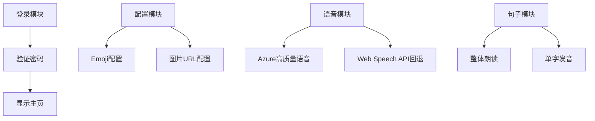
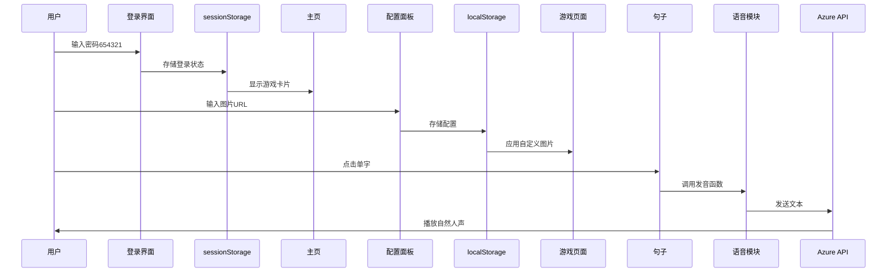

## 用户需求

### 1. 登录访问限制

- 输入特定密码(654321)验证通过后才能进入游戏首页
- 未登录时显示登录界面,禁止直接访问游戏内容

### 2. 图片配置功能增强

- 当前仅支持emoji配置,需要扩展为支持图片URL配置
- 系统为每个元素提供默认图片(从网络获取)
- 允许用户自定义配置线上图片地址
- 适用于字母、单词、汉字三个游戏模块

### 3. 句子跟读单字发音

- 点击句子中的任意文字可以单独发音
- 需要实现文字分词和点击事件绑定

### 4. 语音自然度优化

- 当前Web Speech API声音偏机械
- 需要集成更自然的语音合成服务
- 提升中文和英文的朗读质量

## 产品概述

为儿童学习平台v2.0版本增加登录控制、图片配置增强、句子单字发音和语音自然度优化四大功能,提升安全性和用户体验。

## 核心功能

- 登录验证系统:密码输入框,验证通过后显示主页
- 图片URL配置:扩展配置面板,支持emoji和图片URL两种配置
- 句子分词点击:将句子拆分为可点击的单字,支持单独发音
- 高质量语音:集成第三方语音API(Azure/Google),提供自然人声

## 技术栈选择

- 前端框架:单HTML文件架构(保持现有结构)
- 语音服务:Azure Cognitive Services Speech SDK(高质量中文语音)
- 图片存储:Unsplash API(默认图片)+ 用户自定义URL
- 认证方式:localStorage存储登录状态
- 配置存储:localStorage扩展存储图片URL配置

## 实施方案

### 1. 登录验证系统

**技术方案**:

- 创建登录遮罩层,覆盖整个页面
- 密码输入框(类型password),验证固定密码"654321"
- 使用sessionStorage存储登录状态(关闭浏览器失效,更安全)
- 页面加载时检查登录状态,未登录则显示登录界面

**数据结构**:

```javascript
// 登录状态
sessionStorage.setItem('isLoggedIn', 'true');

// 验证逻辑
const correctPassword = '654321';
```

**UI设计**:

- 居中登录卡片,渐变背景
- 密码输入框+登录按钮
- 错误提示动画

### 2. 图片URL配置功能

**技术方案**:

- 扩展现有emoji配置系统
- 配置数据结构增加imageURL字段
- 配置面板增加图片URL输入框
- 图片显示优先级:自定义URL > 默认URL > emoji
- 提供默认Unsplash图片链接

**数据结构扩展**:

```javascript
// 原有结构
customEmojis = {
  "alphabet|A": "🍎"
}

// 扩展结构
customImages = {
  "alphabet|A": {
    emoji: "🍎",
    imageURL: "https://images.unsplash.com/..."
  }
}
```

**实现要点**:

- 修改generateAlphabetChoices/generateWordChoices/generateChineseChoices函数
- 增加图片加载失败回退机制(fallback到emoji)
- 配置面板分为emoji和图片两个输入区域

### 3. 句子单字发音

**技术方案**:

- 将句子文本拆分为单个字符
- 每个字符包裹在可点击的span标签中
- 点击时调用speak函数发音
- 保持句子整体布局和样式

**实现代码**:

```javascript
function displaySentence() {
  const sentence = shuffledSentences[current].sentence;
  const chars = sentence.split('');
  
  const html = chars.map((char, index) => {
    if (char.match(/[\u4e00-\u9fa5]/)) {
      return `<span class="clickable-char" onclick="speakChar('${char}')">${char}</span>`;
    }
    return char;
  }).join('');
  
  document.getElementById('sentenceText').innerHTML = html;
}

function speakChar(char) {
  speak(char, 'zh-CN');
}
```

**样式设计**:

```css
.clickable-char {
  cursor: pointer;
  transition: all 0.2s;
  display: inline-block;
  padding: 2px 4px;
  border-radius: 4px;
}

.clickable-char:hover {
  background: #667eea20;
  transform: scale(1.1);
}
```

### 4. 语音自然度优化

**技术方案**:

- 集成Azure Cognitive Services Speech SDK
- 使用高质量的神经网络语音
- 兼容方案:优先Azure,失败回退到Web Speech API

**Azure语音配置**:

```javascript
// Azure Speech SDK
const speechConfig = SpeechSDK.SpeechConfig.fromSubscription(
  "YOUR_SUBSCRIPTION_KEY", 
  "YOUR_REGION"
);

// 中文语音(晓晓 - 自然女声)
speechConfig.speechSynthesisVoiceName = "zh-CN-XiaoxiaoNeural";

// 英文语音(Jenny - 自然女声)
speechConfig.speechSynthesisVoiceName = "en-US-JennyNeural";
```

**实现架构**:

```javascript
async function speakNatural(text, lang = 'zh-CN') {
  try {
    // 优先使用Azure高质量语音
    if (window.SpeechSDK && azureEnabled) {
      await speakWithAzure(text, lang);
    } else {
      // 回退到Web Speech API
      speak(text, lang);
    }
  } catch (error) {
    // 失败时回退
    speak(text, lang);
  }
}
```

**备选方案**:

- 免费方案:使用Web Speech API,但优化参数(rate, pitch)
- 付费方案:Azure Speech Service(推荐,声音自然)
- 中间方案:Google Cloud Text-to-Speech

## 实现注意事项

### 性能考虑

- Azure SDK通过CDN加载,避免打包体积过大
- 图片URL加载使用懒加载,避免一次性加载过多图片
- 单字点击事件使用事件委托,减少DOM绑定

### 兼容性

- Azure SDK需要在HTML中引入script标签
- 提供API Key配置入口(配置面板)
- 未配置API Key时自动使用Web Speech API

### 安全性

- 登录密码硬编码在前端,安全性有限
- 建议未来版本接入后端验证
- Azure API Key建议通过环境变量配置

## 架构设计

### 模块划分



### 数据流



## 目录结构

```
/Users/emma/WorkBuddy/20260312092945/
├── learning_platform.html  # [MODIFY] 主文件
│   ├── 登录界面HTML/CSS    # 新增登录遮罩层
│   ├── 图片配置UI          # 扩展配置面板
│   ├── 句子分词显示        # 修改displaySentence
│   ├── Azure SDK集成       # 引入Speech SDK
│   └── 语音函数优化        # 新增speakNatural函数
│
└── versions/
    ├── learning_platform_v2.0.html  # 当前版本备份
    └── learning_platform_v3.0.html  # [NEW] 新版本
```

## 关键代码结构

### 登录验证核心接口

```javascript
// 密码验证
function verifyPassword(input) {
  return input === '654321';
}

// 登录状态检查
function checkLoginStatus() {
  return sessionStorage.getItem('isLoggedIn') === 'true';
}
```

### 图片配置数据结构

```javascript
interface ImageConfig {
  emoji: string;
  imageURL?: string;  // 可选的自定义图片URL
  defaultImageURL: string;  // 系统默认图片
}

// 使用示例
const config = {
  emoji: "🍎",
  imageURL: "https://example.com/custom-apple.jpg",
  defaultImageURL: "https://images.unsplash.com/apple"
};
```

### 语音服务接口

```javascript
interface SpeechService {
  speak(text: string, lang: string): Promise<void>;
  isAvailable(): boolean;
}

class AzureSpeechService implements SpeechService {
  speak(text, lang) { /* Azure实现 */ }
  isAvailable() { return !!this.speechConfig; }
}

class WebSpeechService implements SpeechService {
  speak(text, lang) { /* Web Speech API实现 */ }
  isAvailable() { return !!window.speechSynthesis; }
}
```